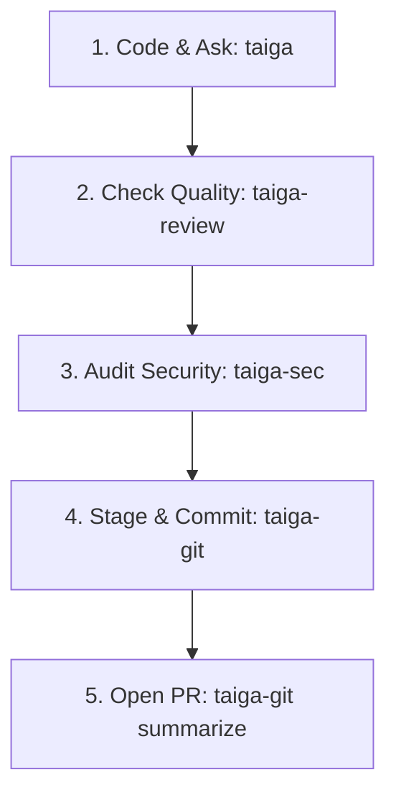

# TaigaAI Typical Developer Workflow

This guide walks you through a typical day-to-day developer loop using the TaigaAI toolchain (`taiga`, `taiga-git`, `taiga-review`, `taiga-sec`). Because TaigaAI is completely local, private, and read-only, it integrates seamlessly and safely into your active command-line cycles.

---

## 🛠️ The Daily TaigaAI Developer Loop



---

### Step 1: Brainstorming & Snippet Drafting (`taiga`)
Instead of opening a browser tab to search StackOverflow or wait on slow cloud LLMs, you ask your local Coder Model for quick structures, algorithms, or shell explanation snippets:

* **Drafting a new class**:
  ```bash
  taiga -p "Write a python class for a thread-safe token bucket rate limiter"
  ```
* **Checking/Explaining shell commands**:
  ```bash
  taiga -c -p "How do I find and kill all processes running on port 8080?"
  ```
  *(Using the `-c` flag isolates the code block so you can instantly copy-paste results without generic chat introduction/outro).*

---

### Step 2: Code Review & Quality Refactoring (`taiga-review`)
You write your code changes into a local file. Before staging or committing, you run an instant, system-bounded peer-review to discover code flaws, optimizations, or missing edge cases:

```bash
taiga-review limiter.py
```
* **Typical Review Output**:
  ```markdown
  [Coder Mode | qwen2.5-coder]
  ✔ File read bounds validated.
  
  ### Code Quality Review: limiter.py
  * 🟢 **Thread Safety**: Lock implementation correct, avoiding active race conditions.
  * 🟡 **Optimization**: In line 24, use `time.monotonic()` instead of `time.time()` to avoid drift during system clock updates.
  * 🔴 **Edge Case**: `capacity` initialization has no guard against negative numbers; throw a `ValueError` if capacity <= 0.
  ```

---

### Step 3: Security & Leak Audit (`taiga-sec`)
Before staging these files, make sure you didn't accidentally leave test keys, credential variables, or introduce validation injection vectors:

```bash
taiga-sec limiter.py
```
* **Typical Audit Output**:
  ```markdown
  [Security Mode | llama3.2]
  ✔ Vulnerability sanitization layer completed.
  
  ### Security Audit Findings:
  * 🟢 **Secret Keys**: No hardcoded API keys, tokens, or environment passwords detected.
  * 🟢 **Data Validation**: Sanitization holds; no raw SQL construction or SQL-injection vectors detected.
  ```

---

### Step 4: Frictionless Git Commit Generation (`taiga-git`)
Apply your changes, then stage them! Instead of typing manually, let the commit assistant read the staged diff to draft a gorgeous, spec-compliant **Conventional Commit**:

```bash
git add limiter.py
taiga-git
```
* **Typical Assistant Output**:
  ```markdown
  [Git Commit Assistant | qwen2.5-coder]
  feat(rate-limit): implement thread-safe token bucket rate limiter

  * Added ThreadSafeTokenBucket class utilizing threading.Lock
  * Configured monotonic system clock checks to prevent time-drift issues
  * Integrated value guards validating initial capacities on start
  ```
* **Execute Commit**:
  If you like it, commit instantly using:
  ```bash
  git commit -m "$(taiga-git)"
  ```

---

### Step 5: Pull Request Summarization (`taiga-git summarize`)
You push your branch to origin. Before opening your browser, let the Thinker model summarize your branch difference relative to the main branch to draft a pristine Markdown PR description:

```bash
taiga-git summarize
```
* **Typical PR Description Output**:
  ```markdown
  [Git PR Summarizer | llama3.2]
  
  ## Summary
  Introduces a thread-safe token bucket rate limiter designed to prevent clock-drift issues by using monotonic checks and enforce input validation rules on startup.
  
  ## Key Changes
  * **limiter.py**: Created complete `ThreadSafeTokenBucket` implementation.
  * **__init__.py**: Exported limiter class globally.
  
  ## Testing & Verification
  * Tested capacity parameters (capacity <= 0 throws ValueError).
  * Monotonic clock validated under simulated high-concurrency requests.
  ```
  *(Copy-paste this direct markdown straight into the GitHub/GitLab PR box!)*

---

## 💎 Why This Workflow Wins
1. **Speed & Focus**: Stay inside your editor/terminal window. No tabs context-switching.
2. **Snappy CPU Guard**: Thanks to built-in smart diff-truncation, large git diffs are handled elegantly without freezing CPU operations.
3. **100% Secure**: Zero data leaks. Your code stays entirely on your local machine.
